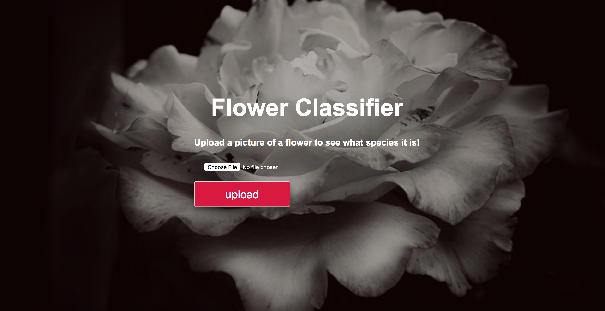

# basic_model_deployment
A basic example of how to deploy a machine learning/deep learning model with Flask. This repo is available as a part of the Heartbeat article, **How to show off your machine learning model: A clear and simple roadmap for deploying your machine learning model and getting it to do something everyone can understand"** 

*You built this amazing machine learning model, but now what?
How do you take your model and turn it into something that you can display on the web? How do you turn it into something that other people can interact with? How do you make it useful?*

*You deploy it!*

*Being able to deploy your machine learning model is an absolute necessity. Whether you're building a model or generating reports, you need this skill.  It takes that model that you poured your blood, sweat, and tears into and turns it into something that absolutely anyone can play with and admire.*

*This article will walk you through the basics of deploying a machine learning model. We're going to deploy a PyTorch image classifier with Flask. This is the first critical step towards turning your model into an app. 
By the end of this article, you'll be able to take a PyTorch image classifier and turn it into a cool web app. In this app, users will be able to upload an image of a flower to see what kind of flower it is. Your image classifier will now be an awesome image prediction app."*

Read the rest of the article here (Coming soon!)

This project utilizes Python, PyTorch, Flask, Numpy, Pandas, Matplotlib, HTML, CSS, JSON, Gunicorn, Pillow, and more.

All of the files are here except for the PyTorch image classifier checkpoint. I want to encourage everyone who's interested to build this app off of their own deep learning models.
